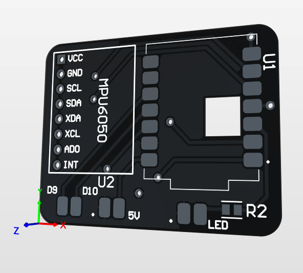
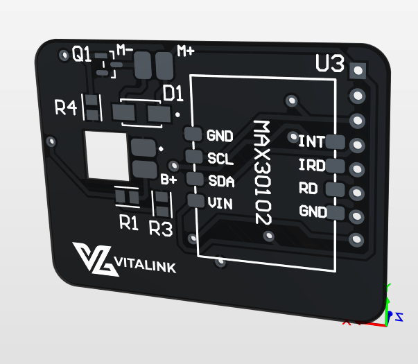
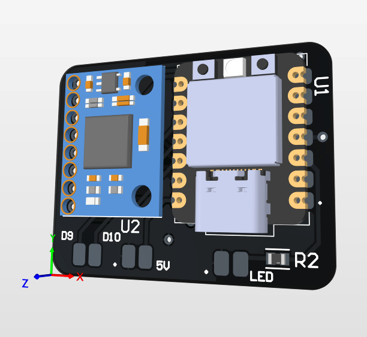
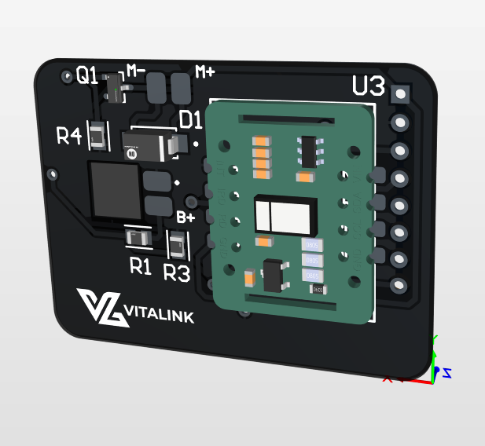
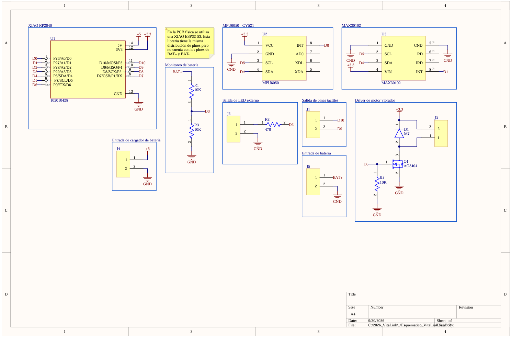

# VitaLink

**VitaLink** es una pulsera inteligente y un ecosistema de aplicaciones diseñado para cuidar a nuestros adultos mayores. Su objetivo es detectar caídas al instante y monitorear signos vitales (oxígeno en sangre y ritmo cardíaco) en tiempo real. 

A diferencia de otras opciones costosas del mercado, VitaLink se conecta por Bluetooth al celular del paciente, usando el teléfono para comunicarse con los familiares. Esto permite que la pulsera sea muy económica, liviana y que su batería dure muchísimo más.

## ¿Cómo funciona el sistema?

El proyecto es el resultado del trabajo en equipo en tres áreas clave:

### 1. El Hardware (La Pulsera)
Diseñamos nuestra propia placa electrónica (PCB) desde cero para que sea lo más pequeña y eficiente posible.
*   **Cerebro (Microcontrolador):** Utilizamos un chip ESP32-S3 de muy bajo consumo.
*   **Sensores de Salud:** 
    *   Un sensor de movimiento (`MPU6050`) que funciona como giroscopio y acelerómetro para saber si la persona se cayó.
    *   Un sensor óptico (`MAX30102`) que lee el pulso y el oxígeno en sangre iluminando la muñeca.
*   **Alertas:** Un pequeño motor vibrador integrado le avisa al paciente si está todo bien o si se va a enviar una alerta a la familia.

#### Nuestro Diseño Electrónico

| Vista Frontal (Top Layer) | Vista Trasera (Bottom Layer) |
| :---: | :---: |
|    *Placa base sin soldar* |    *Placa base sin soldar* |
|    *Placa con componentes* |    *Placa con componentes* |

**Esquemático del Circuito:**

*(Diagrama general de las conexiones electrónicas)*

### 2. El Firmware
Lo escribimos usando **C/C++** (PlatformIO) y utilizando FreeRTOS:
*   Mantiene la conexión Bluetooth con el celular de forma eficiente para ahorrar batería.
*   Limpia matemáticamente el "ruido" de los sensores (por ejemplo, asegura que aplaudir o mover la mano rápido no cuente por error como una caída).

### 3. El Software (La App Móvil)
Desarrollamos una aplicación en **React Native** que se adapta a quién la esté usando:
*   **Modo Paciente:** Una pantalla súper sencilla con números grandes. Su trabajo real es casi invisible: funciona de fondo en el bolsillo del abuelo, vigilando la pulsera por Bluetooth y consiguiendo la ubicación GPS si ocurre una emergencia.
*   **Modo Familiar:** Un panel de control para los hijos o cuidadores. Aquí pueden ver el pulso y oxígeno en tiempo real. Si hay una caída, el celular del familiar sonará súper fuerte (saltándose el modo "No Molestar" si es de noche) y mostrará dónde está el paciente en un mapa.
