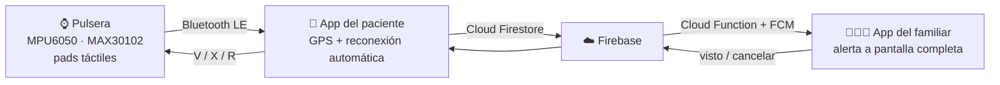
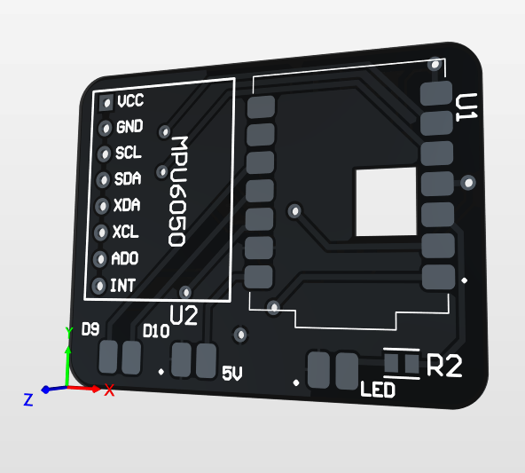
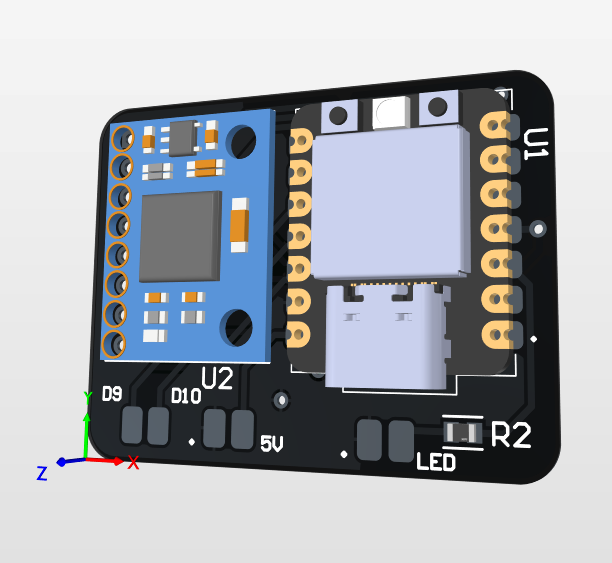
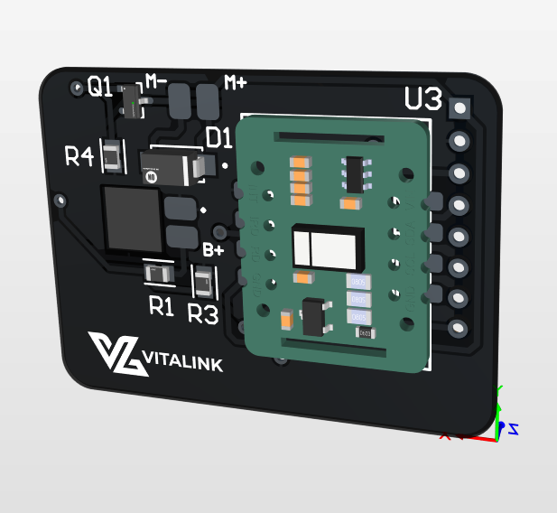
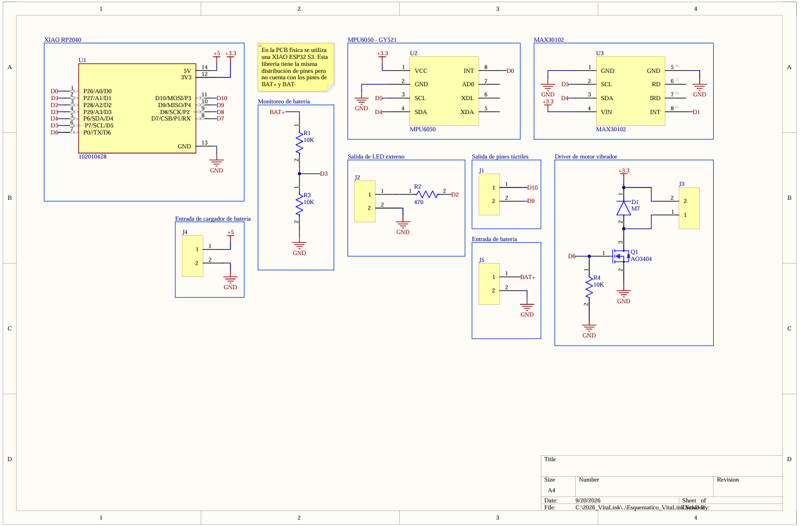
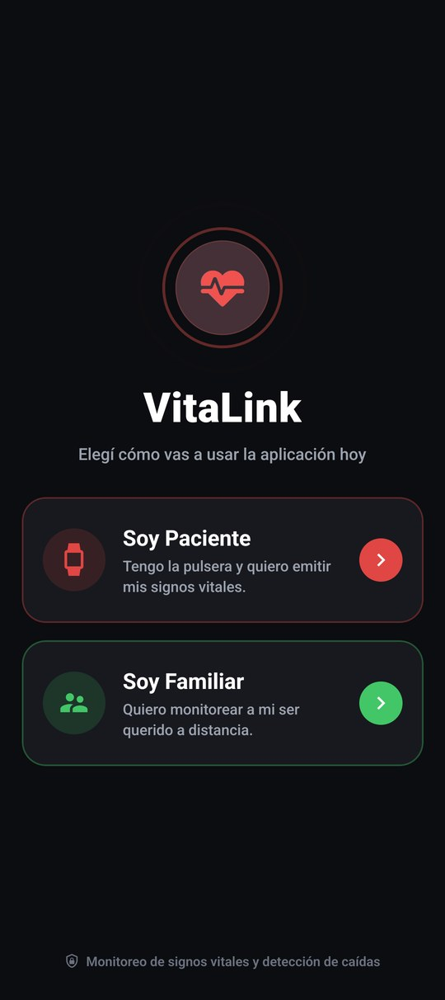
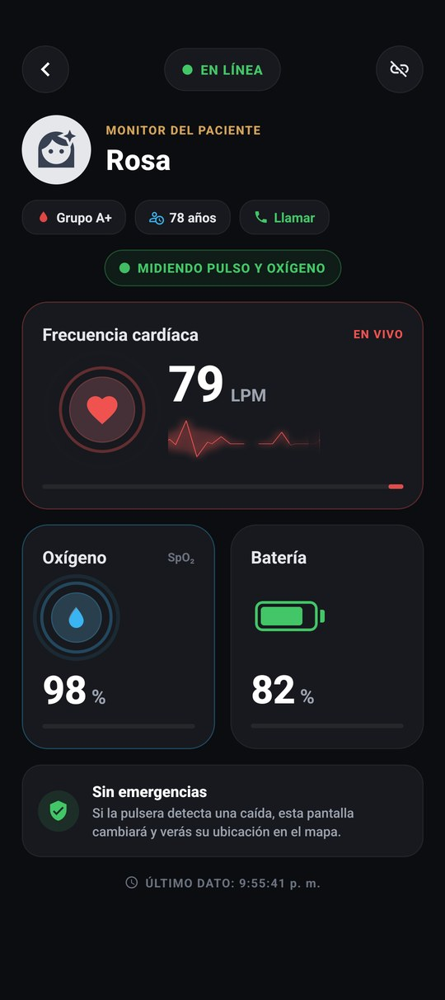
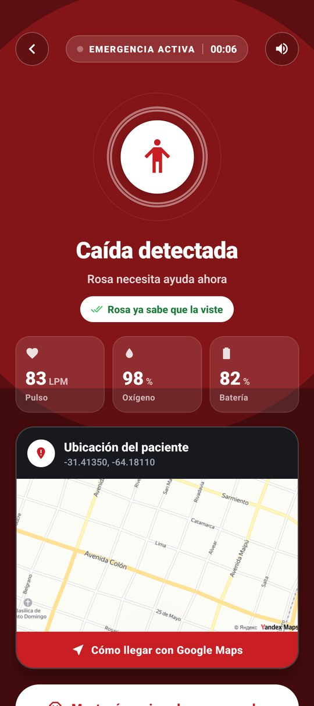

<div align="center">

# 💓 VitaLink

**Pulsera inteligente que detecta caídas y avisa a la familia, pensada para adultos mayores que viven solos.**


*Proyecto integrador · 7.° año B · Electrónica · Instituto Técnico Salesiano Villada · Córdoba, Argentina · 2026*

</div>

---

## 📑 Contenido

1. [¿Qué es VitaLink?](#-qué-es-vitalink)
2. [El problema](#-el-problema)
3. [Cómo funciona](#-cómo-funciona)
4. [Hardware](#-hardware)
5. [Firmware](#-firmware)
6. [Aplicación móvil](#-aplicación-móvil)
7. [Estructura del repositorio](#-estructura-del-repositorio)
8. [Cómo compilar y usar](#-cómo-compilar-y-usar)
9. [Limitaciones y próximos pasos](#-limitaciones-y-próximos-pasos)
10. [Equipo](#-equipo)

---

## 💡 ¿Qué es VitaLink?

VitaLink es un **ecosistema** formado por una pulsera y una aplicación móvil:

- La **pulsera** detecta caídas por sí sola, mide el pulso y el oxígeno en sangre, y tiene una zona táctil de **S.O.S.** para pedir ayuda con un toque. No tiene pantallas ni menús: no hay nada que configurar.
- El **celular del paciente** hace de puente: recibe los datos por Bluetooth Low Energy y los sube a la nube junto con la ubicación GPS.
- La **familia** recibe la alerta al instante en su celular, con la ubicación exacta y los signos vitales en vivo.

Usar el celular como puente permite que la pulsera sea **chica (30 × 40 mm), económica y de bajo consumo**.

---

## 📊 El problema

| | |
|---|---|
| **1.200.000** | adultos mayores de 65 años viven solos en Argentina *(Censo INDEC)* |
| **33 %** | declara sentir una soledad profunda *(Cruz Roja Argentina)* |
| **6.ª causa** | de muerte después de los 75 años son las caídas |
| **90 %** | de las fracturas en adultos mayores viene de una caída previa |

Después de una caída, **el tiempo en el piso** es lo que más importa: horas sin ayuda llevan a deshidratación, infecciones y úlceras, y un golpe que se podía curar puede volverse grave. Las alternativas actuales (geriátrico, cuidador, smartwatch o botón de pánico fijo) son caras, invaden la independencia o dejan zonas sin cobertura.

---

## 🔄 Cómo funciona


```mermaid
flowchart LR
    P["⌚ Pulsera<br/>MPU6050 · MAX30102<br/>pads táctiles"] -- "Bluetooth LE" --> C["📱 App del paciente<br/>GPS + reconexión automática"]
    C -- "Cloud Firestore" --> N["☁️ Firebase"]
    N -- "Cloud Function + FCM" --> F["👨‍👩‍👧 App del familiar<br/>alerta a pantalla completa"]
    F -- "visto / cancelar" --> N
    N --> C
    C -- "V / X / R" --> P
```

**Ante una caída:**

1. La pulsera detecta la **caída libre**, el **impacto** y confirma que la persona **quedó quieta**.
2. Vibra en pulsos y avisa al celular del paciente por Bluetooth.
3. La app crea la alerta en Firestore con la **ubicación GPS**.
4. Una Cloud Function envía una **notificación push** a todos los familiares vinculados.
5. El familiar ve la alerta a pantalla completa con sirena, el mapa y el botón **"Cómo llegar"**.
6. Cuando un familiar la ve, la pulsera espacia los pulsos para que el paciente sepa que ya lo vieron. La alerta se cancela desde la app o tocando **Cancelar** en la pulsera.

---

## 🔧 Hardware

### Componentes

| Componente | Función | Conexión |
|---|---|---|
| **Seeed Studio XIAO ESP32-S3** | Microcontrolador de 2 núcleos con Bluetooth 5 (BLE) y cargador de batería LiPo | — |
| **MPU6050 (GY-521)** | Acelerómetro para detectar caídas (±8 g, 50 muestras/s, giroscopio apagado) | I²C · INT → `D0` |
| **MAX30102** | Sensor óptico de pulso (BPM) y oxígeno en sangre (SpO₂) | I²C · INT → `D1` |
| **Pad táctil S.O.S.** | Pedir ayuda (3 toques) y despertar la pulsera | `D9` (táctil capacitivo) |
| **Pad táctil Cancelar** | Cancelar una alerta | `D10` (táctil capacitivo) |
| **Motor vibrador** | Avisos hápticos (toques, S.O.S., alarma) | `D6` |
| **Batería LiPo** | Alimentación, medida con divisor resistivo al ADC | ADC |
| **Pads de carga** | GND y 5 V para el cargador magnético | — |

### Placa propia (PCB)

Diseñada en **Altium Designer**, de doble faz, con componentes SMD.

| Vista frontal (top) | Vista trasera (bottom) |
| :---: | :---: |
|  <br> *Placa sin componentes* |  <br> *Placa sin componentes* |
|  <br> *Placa con componentes* |  <br> *Placa con componentes* |

**Esquemático:**



### Carcasa y cargador

Modelados en **Fusion 360** e impresos en 3D (archivos en `Diseño 3d/`):

- **Pulsera:** base con ventana óptica para el sensor de pulso y anclajes de la correa, y tapa con las chapas metálicas (zonas táctiles S.O.S. y Cancelar, y pads de carga).
- **Cargador magnético:** dos piezas que se apoyan **sobre** la pulsera. Sus pogo pins tocan los pads de carga, así el adulto **no tiene que sacarse la pulsera para cargarla** y nunca queda desprotegido.

---

## 💻 Firmware

Escrito en **C++** con **PlatformIO** (framework Arduino) sobre **FreeRTOS**. Código en [`Firmware/VitaLink`](Firmware/VitaLink).

### Tareas

| Tarea | Núcleo | Qué hace |
|---|:---:|---|
| `TaskBLE` | 0 | Servidor Bluetooth, batería, comandos de la app, OTA y sueño profundo |
| `TaskMAX30102` | 1 | Detección de muñeca y medición de pulso y oxígeno |
| `TaskMPU6050` | 1 | Detección de caídas a 50 Hz por interrupción |
| `TaskMotor` | — | Patrones de vibración |
| `TaskTactil` | 0 | Lectura de los pads S.O.S. y Cancelar |

- El bus I²C se comparte con un **mutex** (`i2cMutex`).
- Un **watchdog** reinicia la pulsera si alguna tarea se cuelga más de 10 s.

### Detección de caídas

Algoritmo en 3 pasos con parámetros **configurables desde la app** y guardados en la memoria de la pulsera:

| Paso | Condición (valores de fábrica) |
|---|---|
| **1. Caída libre** | Aceleración menor a **0,66 g** |
| **2. Impacto** | Más de **7,7 g**, entre **400 y 750 ms** después de empezar la caída libre (más rápido es un gesto del brazo) |
| **3. Confirmación** | Se ignoran 500 ms de rebotes y la persona tiene que quedar **quieta el 95 %** del tiempo hasta completar **2 s** desde el impacto |

- **Solo se detectan caídas** con el celular conectado y la pulsera puesta, para evitar falsas alarmas si se cae de la mesa.
- Si el sensor de pulso no responde, se detecta igual.
- **Modo calibración:** la app muestra la aceleración en vivo y los eventos de cada prueba, sin disparar alertas reales.

### Pulso y oxígeno

- **Detección de muñeca:** un destello infrarrojo cada 1 s, y cada 3 s si pasó más de un minuto sin que nadie la use. Entre destellos, el chip queda apagado (~1 µA).
- **Ciclos de medición:** 30 s midiendo y 15 s de pausa. Los primeros 15 s se descartan mientras el sensor se estabiliza.
- **Lectura del FIFO:** se leen todas las muestras del FIFO por interrupción. El **BPM** sale del pico de cada latido y de la mediana de los últimos latidos, y el **SpO₂** de la componente pulsátil (RMS) con mediana de ventanas.
- **Movimiento:** si la muñeca se mueve, el acelerómetro lo avisa y esas muestras se descartan.

### Pads táctiles y vibración

| Gesto | Resultado |
|---|---|
| **3 toques** en S.O.S. | Envía un pedido de ayuda. Si no hay celular, queda pendiente hasta 5 min y se envía al reconectar |
| **1 toque** en Cancelar | Cancela la alerta en curso (en la pulsera y en la app) |
| **Mantener los dos pads 5 s** y soltar | Reinicia la pulsera |
| **Apoyar el cargador** | Se detecta y los pads se recalibran solos, sin vibrar |

| Vibración | Significado |
|---|---|
| Pulso corto | Toque registrado |
| Pulso largo (1,5 s) | S.O.S. enviado |
| 2 pulsos medios | S.O.S. sin celular |
| 3 pulsos cortos | Alerta cancelada |
| Pulsos continuos | Alerta en curso, se espacian cuando un familiar la vio |

### Ahorro de energía

- **Procesador:** CPU a **80 MHz** (240 MHz solo durante la actualización OTA).
- **Radio:** potencia BLE de **+6 dBm** e intervalo de conexión de 50–100 ms con latencia 3.
- **Sin celular:** anuncio rápido el primer minuto y después lento.
- **Sensores:** giroscopio apagado de forma permanente, y acelerómetro y sensor de pulso dormidos cuando no se usan.
- **Sueño profundo:** después de **5 min sin celular** la pulsera duerme. Se despierta cada 45 s para anunciarse, o al instante con un toque en **S.O.S.**

### Bluetooth (servicio `4fafc201-…`)

| Característica | Termina en | Uso |
|---|:---:|---|
| BPM / SpO₂ / Batería | `…26a8` `…26a9` `…26aa` | Signos vitales (notify) |
| Caída | `…26ab` | Alerta de caída. La app escribe `V` (visto), `X` (cancelada), `R` (reiniciar) |
| S.O.S. | `…26ac` | Pedido de ayuda |
| OTA | `…26ad` `…26ae` `…26af` | Versión, control y datos de la actualización |
| Calibración de caídas | `…26b0` `…26b1` | Aceleración en vivo y parámetros |
| Calibración de pulso | `…26b2` `…26b3` | Onda del pulso en vivo y parámetros |
| Diagnóstico táctil | `…26b4` | Lecturas del pad S.O.S. (solo con `DEPURAR_TACTIL`) |

### Actualización inalámbrica (OTA)

La pulsera se actualiza **por Bluetooth desde la app**. Al compilar, el script [`publicar_ota.py`](Firmware/VitaLink/publicar_ota.py) publica el firmware nuevo y registra la versión en Firestore. La app avisa que hay una actualización y la instala con una barra de progreso.

---

## 📱 Aplicación móvil

Hecha en **React Native (Expo)** con **Firebase**: autenticación anónima, Cloud Firestore en tiempo real, Cloud Messaging y Cloud Functions. El código está en la rama [`feature-aplicacion-movil`](../../tree/feature-aplicacion-movil), carpeta `software/VitaLink`.

| Inicio | Paciente | Familiar | Alerta de caída |
| :---: | :---: | :---: | :---: |
|  |  |  |  |

### Modo Paciente

- Conexión y **reconexión automática** con la pulsera, que sigue funcionando con la pantalla apagada.
- Pulso, oxígeno y batería en vivo, con el estado del sensor ("midiendo", "sin muñeca", "pausa").
- Comparte la **ubicación GPS** con la familia y avisa si falta el permiso o el GPS está apagado.
- **Pantalla de emergencia** a pantalla completa ante una caída o S.O.S., indicando qué familiares ya la vieron.
- **Ajustes:** calibrar la detección de caídas y el sensor de pulso, actualizar el firmware (OTA), reiniciar la pulsera y editar el perfil.

### Modo Familiar

- **Varios pacientes** en una misma cuenta, vinculados con un código **QR**.
- Signos vitales en vivo y **última ubicación** en el mapa.
- **Alerta a pantalla completa** con sirena, aunque la app esté cerrada, con la ubicación y el botón **"Cómo llegar con Google Maps"**.
- Avisa al paciente que la alerta fue **vista** y permite **cancelarla** manteniendo presionado.
- Ficha médica de emergencia: grupo sanguíneo, edad, alergias y teléfono.

| Calibración de caídas | S.O.S. del paciente |
| :---: | :---: |
|  |  |

---

## 🗂 Estructura del repositorio

```
2026_VitaLink/
├── Firmware/VitaLink/        # Firmware de la pulsera (PlatformIO)
│   ├── src/                  #   main, detección de caídas, MAX30102, BLE, OTA, batería
│   ├── include/              #   cabeceras
│   ├── platformio.ini
│   └── publicar_ota.py       #   publica cada compilación para la actualización OTA
├── Hardware/MainBoard_VitaLink/  # Proyecto de Altium, esquemático (PDF) y Gerbers
├── Diseño 3d/                # Carcasa y cargador (Fusion 360)
└── Assets/                   # Imágenes del README
```

| Rama | Contenido |
|---|---|
| `main` | Rama principal |
| `feature-integracion-de-codigo` | Firmware completo integrado |
| `feature-aplicacion-movil` | Aplicación móvil (`software/VitaLink`) y Cloud Functions (`software/firebase-functions`) |

---

## 🛠 Cómo compilar y usar

### Firmware

1. Instalar **VS Code** con la extensión **PlatformIO**.
2. Abrir la carpeta `Firmware/VitaLink`.
3. Conectar la XIAO por USB y ejecutar **Upload** (o `pio run -t upload`).
4. Las siguientes versiones se pueden instalar **por Bluetooth** desde la app (OTA).

### Aplicación

```bash
cd software/VitaLink
npm install
npx expo run:android          # desarrollo con un celular conectado
cd android && ./gradlew assembleRelease   # APK de release
```

> Hace falta el archivo `google-services.json` del proyecto de Firebase.
> Compilando con `VITALINK_DEMO=1`, la app usa datos simulados (sin pulsera ni Firebase), por ejemplo para sacar capturas.

### Uso de la pulsera

1. Abrir la app, elegir **Soy Paciente**, completar el perfil y conectar la pulsera.
2. En el celular del familiar, elegir **Soy Familiar** y escanear el **QR** del perfil del paciente.
3. Listo: la pulsera vigila sola. Para pedir ayuda, **3 toques en S.O.S.**

---

## 🚧 Limitaciones y próximos pasos

**Limitaciones actuales**

- Menos precisa que un equipo clínico especializado.
- Necesita el celular del paciente cerca para avisar.
- Una caída muy lenta (por ejemplo, deslizarse de una silla) puede no tener caída libre: para eso está el botón S.O.S.
- El pulso y el oxígeno se **monitorean** en la app, pero todavía no generan alertas automáticas.

**Próximos pasos**

- 🔬 **Miniaturizar la placa** e integrar los sensores directamente en la PCB.
- ⌚ **Diseño más ergonómico** y resistente al agua.
- 💊 **Recordatorios de medicación** con vibración.

---

## 👥 Equipo

**Grupo N.° 5 · 7.° año B · Electrónica**

| Integrantes |
|---|
| Franco Castillo |
| Valentín Cerri |
| Francisco Salatín |
| Santiago Virgolini |

**Instituto Técnico Salesiano Villada** · Córdoba, Argentina

<div align="center">

*VitaLink · Cuidado inteligente para quienes más querés* ❤️

</div>
